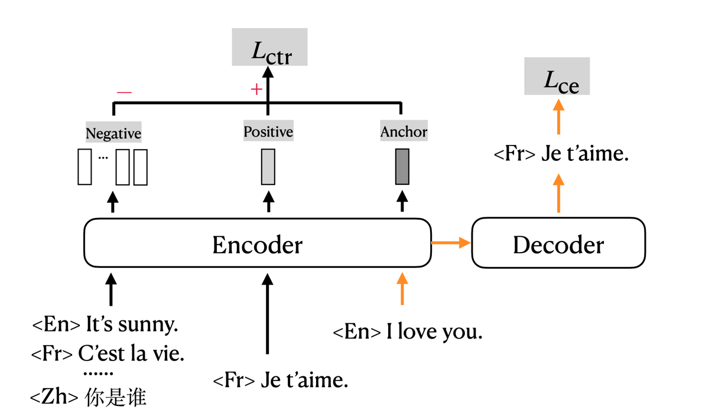

# Contrastive Learning for Many-to-many Multilingual Neural Machine Translation(mCOLT/mRASP2), ACL2021
The code for training mCOLT/mRASP2, a multilingual NMT training framework, implemented based on [fairseq](https://github.com/pytorch/fairseq).

**mRASP2**: [paper](https://arxiv.org/abs/2105.09501)

**mRASP**: [paper](https://www.aclweb.org/anthology/2020.emnlp-main.210.pdf),
[code](https://github.com/linzehui/mRASP)

---
## News
We have released two versions, this version is the original one. In this implementation:
- You should first merge all data, by pre-pending language token before each sentence to indicate the language.
- AA/RAS muse be done off-line (before binarize), check [this toolkit](https://github.com/linzehui/mRASP/blob/master/preprocess).

**New implementation**: https://github.com/PANXiao1994/mRASP2/tree/new_impl

* Acknowledgement: This work is supported by [Bytedance](https://bytedance.com). We thank [Chengqi](https://github.com/zhaocq-nlp) for uploading all files and checkpoints.

## Introduction

mRASP2/mCOLT, representing multilingual Contrastive Learning for Transformer, is a multilingual neural machine translation model that supports complete many-to-many multilingual machine translation. It employs both parallel corpora and multilingual corpora in a unified training framework. For detailed information please refer to the paper.  



## Pre-requisite
```bash
pip install -r requirements.txt
```

## Training Data and Checkpoints
We release our preprocessed training data and checkpoints in the following.
### Dataset

We merge 32 English-centric language pairs, resulting in 64 directed translation pairs in total. The original 32 language pairs corpus contains about 197M pairs of sentences. We get about 262M pairs of sentences after applying RAS, since we keep both the original sentences and the substituted sentences. We release both the original dataset and dataset after applying RAS.

| Dataset | #Pair |
| --- | --- |
| [32-lang-pairs-TRAIN](http://sf3-ttcdn-tos.pstatp.com/obj/nlp-opensource/acl2021/mrasp2/bin_parallel/download.sh) | 197603294 |
| [32-lang-pairs-RAS-TRAIN](http://sf3-ttcdn-tos.pstatp.com/obj/nlp-opensource/acl2021/mrasp2/bin_parallel_ras/download.sh) | 262662792 |
| [mono-split-a](http://sf3-ttcdn-tos.pstatp.com/obj/nlp-opensource/acl2021/mrasp2/bin_mono_split_a/download.sh) | - |
| [mono-split-b](http://sf3-ttcdn-tos.pstatp.com/obj/nlp-opensource/acl2021/mrasp2/bin_mono_split_b/download.sh) | - |
| [mono-split-c](http://sf3-ttcdn-tos.pstatp.com/obj/nlp-opensource/acl2021/mrasp2/bin_mono_split_c/download.sh) | - |
| [mono-split-d](http://sf3-ttcdn-tos.pstatp.com/obj/nlp-opensource/acl2021/mrasp2/bin_mono_split_d/download.sh) | - |
| [mono-split-e](http://sf3-ttcdn-tos.pstatp.com/obj/nlp-opensource/acl2021/mrasp2/bin_mono_split_e/download.sh) | - |
| [mono-split-de-fr-en](http://sf3-ttcdn-tos.pstatp.com/obj/nlp-opensource/acl2021/mrasp2/bin_mono_de_fr_en/download.sh) | - |
| [mono-split-nl-pl-pt](http://sf3-ttcdn-tos.pstatp.com/obj/nlp-opensource/acl2021/mrasp2/bin_mono_nl_pl_pt/download.sh) | - |
| [32-lang-pairs-DEV-en-centric](http://sf3-ttcdn-tos.pstatp.com/obj/nlp-opensource/acl2021/mrasp2/bin_dev_en_centric/download.sh) | - |
| [32-lang-pairs-DEV-many-to-many](http://sf3-ttcdn-tos.pstatp.com/obj/nlp-opensource/acl2021/mrasp2/bin_dev_m2m/download.sh) | - |
| [Vocab](http://sf3-ttcdn-tos.pstatp.com/obj/nlp-opensource/acl2021/mrasp2/bpe_vocab) | - |
| [BPE Code](http://sf3-ttcdn-tos.pstatp.com/obj/nlp-opensource/acl2021/mrasp2/bpe_vocab) | - |


### Checkpoints & Results
* **Please note that the provided checkpoint is sightly different from that in the paper.** In the following sections, we report the results of the provided checkpoints.

#### English-centric Directions
We report **tokenized BLEU** in the following table. (check eval.sh for details)

|  | [6e6d-no-mono](http://sf3-ttcdn-tos.pstatp.com/obj/nlp-opensource/acl2021/mrasp2/6e6d_no_mono.pt) | [12e12d-no-mono](http://sf3-ttcdn-tos.pstatp.com/obj/nlp-opensource/acl2021/mrasp2/12e12d_no_mono.pt) | [12e12d](http://sf3-ttcdn-tos.pstatp.com/obj/nlp-opensource/acl2021/mrasp2/12e12d_last.pt) |
| --- | --- | --- | --- |
| en2cs/wmt16 | 21.0 | 22.3 | 23.8 |
| cs2en/wmt16 | 29.6 | 32.4 | 33.2 |
| en2fr/wmt14 | 42.0 | 43.3 | 43.4 |
| fr2en/wmt14 | 37.8 | 39.3 | 39.5 |
| en2de/wmt14 | 27.4 | 29.2 | 29.5 |
| de2en/wmt14 | 32.2 | 34.9 | 35.2 |
| en2zh/wmt17 | 33.0 | 34.9 | 34.1 |
| zh2en/wmt17 | 22.4 | 24.0 | 24.4 |
| en2ro/wmt16 | 26.6 | 28.1 | 28.7 |
| ro2en/wmt16 | 36.8 | 39.0 | 39.1 |
| en2tr/wmt16 | 18.6 | 20.3 | 21.2 |
| tr2en/wmt16 | 22.2 | 25.5 | 26.1 |
| en2ru/wmt19 | 17.4 | 18.5 | 19.2 |
| ru2en/wmt19 | 22.0 | 23.2 | 23.6 |
| en2fi/wmt17 | 20.2 | 22.1 | 22.9 |
| fi2en/wmt17 | 26.1 | 29.5 | 29.7 |
| en2es/wmt13 | 32.8 | 34.1 | 34.6 |
| es2en/wmt13 | 32.8 | 34.6 | 34.7 |
| en2it/wmt09 | 28.9 | 30.0 | 30.8 |
| it2en/wmt09 | 31.4 | 32.7 | 32.8 |

#### Unsupervised Directions
We report **tokenized BLEU** in the following table. (check eval.sh for details)

| | 12e12d |
| --- | --- |
| en2pl/wmt20 | 6.2 |
| pl2en/wmt20 | 13.5 |
| en2nl/iwslt14 | 8.8 |
| nl2en/iwslt14 | 27.1 |
| en2pt/opus100 | 18.9 |
| pt2en/opus100 | 29.2 |

#### Zero-shot Directions
* row: source language
* column: target language
We report **[sacreBLEU](https://github.com/mozilla/sacreBLEU)** in the following table.

| 12e12d  | ar | zh | nl | fr | de | ru |
| --- | --- | --- | --- | --- | --- | --- |
| ar | - | 32.5 | 3.2 | 22.8 | 11.2 | 16.7 |
| zh | 6.5 | - | 1.9 | 32.9 | 7.6 | 23.7 |
| nl | 1.7 | 8.2 | - | 7.5 | 10.2 | 2.9 |
| fr | 6.2 | 42.3 | 7.5 | - | 18.9 | 24.4 |
| de | 4.9 | 21.6 | 9.2 | 24.7 | - | 14.4 |
| ru | 7.1 | 40.6 | 4.5 | 29.9 | 13.5 | - |

## Training
```bash
export NUM_GPU=4 && bash train_w_mono.sh ${model_config}
```
* We give example of `${model_config}` in `${PROJECT_REPO}/examples/configs/parallel_mono_12e12d_contrastive.yml`

## Inference
* You must pre-pend the corresponding language token to the source side before binarize the test data.
```bash
fairseq-generate ${test_path} \
    --user-dir ${repo_dir}/mcolt \
    -s ${src} \
    -t ${tgt} \
    --skip-invalid-size-inputs-valid-test \
    --path ${ckpts} \
    --max-tokens ${batch_size} \
    --task translation_w_langtok \
    ${options} \
    --lang-prefix-tok "LANG_TOK_"`echo "${tgt} " | tr '[a-z]' '[A-Z]'` \
    --max-source-positions ${max_source_positions} \
    --max-target-positions ${max_target_positions} \
    --nbest 1 | grep -E '[S|H|P|T]-[0-9]+' > ${final_res_file}
python3 ${repo_dir}/scripts/utils.py ${res_file} ${ref_file} || exit 1;
```

## Synonym dictionaries
We use the bilingual synonym dictionaries provised by [MUSE](https://github.com/facebookresearch/MUSE).

We generate multilingual synonym dictionaries using [this script](https://github.com/linzehui/mRASP/blob/master/preprocess/tools/ras/multi_way_word_graph.py), and apply
RAS using [this script](https://github.com/linzehui/mRASP/blob/master/preprocess/tools/ras/random_alignment_substitution_w_multi.sh).

| Description | File | Size |
| --- | --- | --- |
| dep=1 | [synonym_dict_raw_dep1](http://sf3-ttcdn-tos.pstatp.com/obj/nlp-opensource/acl2021/mrasp2/synonym_dict_raw_dep1) | 138.0 M |
| dep=2 | [synonym_dict_raw_dep2](http://sf3-ttcdn-tos.pstatp.com/obj/nlp-opensource/acl2021/mrasp2/synonym_dict_raw_dep2) | 1.6 G |
| dep=3 | [synonym_dict_raw_dep3](http://sf3-ttcdn-tos.pstatp.com/obj/nlp-opensource/acl2021/mrasp2/synonym_dict_raw_dep3) | 2.2 G |

## Contact
Please contact me via e-mail `panxiao94@163.com` or via [wechat/zhihu](https://fork-ball-95c.notion.site/mRASP2-4e9b3450d5aa4137ae1a2c46d5f3c1fa)

## Citation
Please cite as:
```
@inproceedings{mrasp2,
  title = {Contrastive Learning for Many-to-many Multilingual Neural Machine Translation},
  author= {Xiao Pan and
           Mingxuan Wang and
           Liwei Wu and
           Lei Li},
  booktitle = {Proceedings of ACL 2021},
  year = {2021},
}
```
